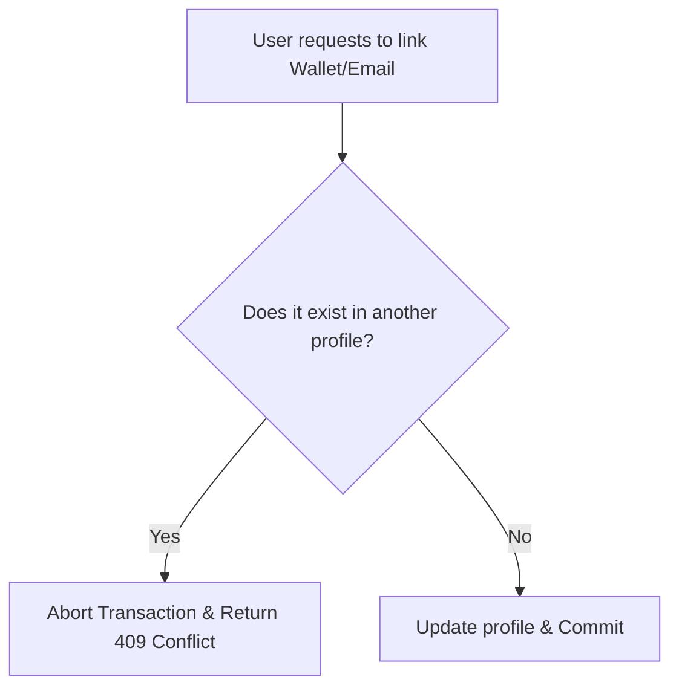

# Security Notice: Hybrid Authentication & Account Linking Policy

This document outlines the security requirements for the implementation of our **Hybrid Authentication** (Wallet Connect + Email Magic Links) system. Please ensure the database schema and API routes adhere to these rules.

---

## The One Security Rule You Must Follow during Implementation

The primary security risk with a hybrid authentication model is how account linking is handled in the database.

> [!CAUTION]
> ### Avoid Account Hijacking (Safe Linking)
> You must ensure that an email or wallet can only be linked to **one** account in the system at any given time.

### Example Scenario
*   **User A** registers and links `Wallet X` to `emailA@gmail.com`.
*   **User B** registers with `emailB@gmail.com` and attempts to link the same `Wallet X` to their account.
*   **Required Action:** The backend API **must block this action** and throw a conflict error (e.g., `409 Conflict`). 
*   **The Risk:** If the backend allows the link, **User B** could log in using `Wallet X` and hijack **User A**'s account history, transaction data, and personal details.

---

## Recommended Database Constraints (PostgreSQL / Supabase)

To enforce this rule natively at the database layer (preventing race conditions or API-level bugs), apply unique constraints to the tracking tables:

### 1. Unique Constraints
Ensure that the columns storing the wallet address and the email address are marked as `UNIQUE`:

```sql
ALTER TABLE public.profiles
ADD CONSTRAINT unique_wallet_address UNIQUE (wallet_address);

ALTER TABLE public.profiles
ADD CONSTRAINT unique_email UNIQUE (email);
```

### 2. Transaction / Linking Logic Flow
When a user attempts to link a wallet or an email, the database transaction should follow this logic:



Please review these constraints before configuring the Supabase Row Level Security (RLS) policies and authentication hooks.
